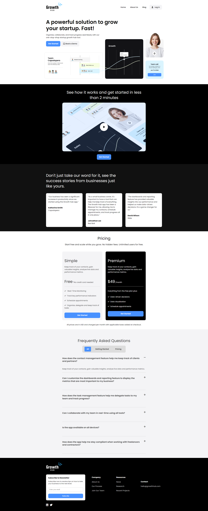

# Growth Hub Landing Page

Welcome to the Growth Hub landing page project! This is a part of my endeavor to create a professional website for my SaaS company, Growth Hub.

## Project Overview

This project is dedicated to designing and developing a landing page for my SaaS (Software as a Service) company. Unlike using external frameworks or libraries, this landing page is crafted with pure HTML and CSS, showcasing a clean and minimalistic design. Additionally, I've incorporated a touch of JavaScript to enhance user experience, including features like the responsive hamburger menu and a dynamic FAQ accordion.

## Project Preview

To give you a glimpse of what I've created, here's a preview of my landing page:

The screenshot above provides a visual representation of landing page, which encapsulates the essence of my SaaS offering and the user-friendly design I've meticulously crafted.

## Getting Started

To explore this project and view the code and design elements in detail, simply clone this repository to your local development environment and open the HTML, CSS, and JavaScript files using your preferred code editor. You can then run the project locally to experience it in action.

## Feedback and Contributions

I welcome feedback, suggestions, and contributions from the community. If you have any ideas for improvements, want to report issues, or contribute enhancements to this project, please feel free to create issues or pull requests. I believe in the power of collaboration to make this landing page or web app even better!

Thank you for your interest in my project. I hope you find it inspiring and a testament to my commitment to providing a top-notch user experience for my SaaS platform.
